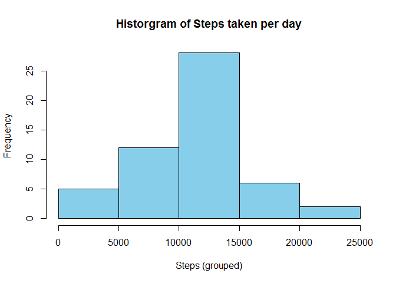
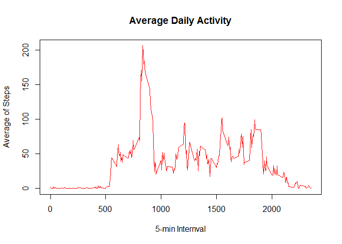
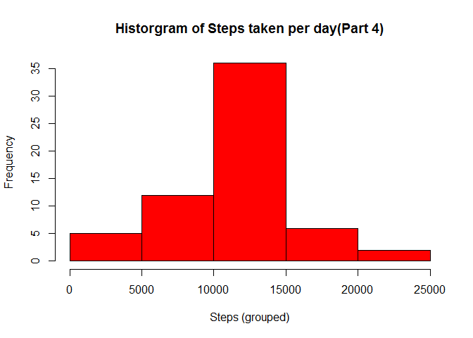

# Reproducible Research: Peer Assessment 1


This Assignment tries to answer the following 4 questions:
 
1. What is mean total number of steps taken per day? 
2. What is the average daily activity pattern 
3. Imputing missing values 
4. Are there differences in activity patterns between weekdays and weekends? 


### Loading and processing the data
Here it is assumed that you have the downloaded the data and saved it in a zip file named "activity.zip" and is placed in the working directory.


```r
## Please note I have taken this course before
## Thus you might find a few things being replicated
## But I have tried to remove the previous repo and start a new.
unzip("activity.zip", exdir = "activity")
datass <- read.csv("./activity/activity.csv" 
                 , stringsAsFactors = FALSE)
datass$date <- as.character(datass$date)
datass$date <- as.Date(datass$date)
comdata <- datass[complete.cases(datass),]
```


### What is mean total number of steps taken per day? 

For this part we were first required to make a histogram of the total number of steps taken each day


```r
p1 <- aggregate(steps~date, datass, sum)
hist(p1$steps, col= "skyblue", main = "Historgram of Steps taken per day", xlab= "Steps (grouped)")
```

 


```r
m <- mean(p1$steps)
m
```

```
## [1] 10766.19
```

The mean total number of steps taken per day is $1.0766189\times 10^{4}$


```r
md <- median(p1$steps)
md
```

```
## [1] 10765
```

The median total number of steps taken per day is $10765$


### What is the average daily activity pattern?
First we are required to make a time series plot (i.e. type = "l") of the 5-minute interval (x-axis) and the average number of steps taken, averaged across all days (y-axis)

```r
p2 <- aggregate(steps ~ interval,comdata, mean)
plot(p2$interval, p2$steps, type="l", main = "Average Daily Activity", xlab = "5-min Internval", ylab = "Average of Steps", col = "red")
```

 

Then we are asked to get the 5-minute interval, on average across all the days in the dataset, which contains the maximum number of steps.

```r
maxint <-p2[which.max(p2$steps),1]
maxint
```

```
## [1] 835
```

Which is interval 835

### Imputing missing values

First we are asked to calculte Missing value:

```r
p3 <- sum(is.na(datass))
p3
```

```
## [1] 2304
```
We have 2304 missing values in our data. 

Now

1. We use the average steps taken for 5-min intervals to fill the missing values 
2. Create a new dataset (called dataset below) that is equal to the original dataset but with the missing data filled in 


```r
p4 <- merge(datass, p2, by="interval", na.action=na.pass)
p4$steps.x[is.na(p4$steps.x)] <- p4$steps.y[is.na(p4$steps.x)]
names(p4) <- c("interval", "steps", "date", "stepsy")
## The new dataset
newdata <- data.frame(p4$steps, p4$date, p4$interval)
names(newdata) <- c("steps", "date", "interval")
```
Now we plot historgram of total number of steps taken each day and report the mean and median.


```r
p5 <- aggregate(steps~date, newdata, sum)
hist(p5$steps, col= "red", main = "Historgram of Steps taken per day(Part 4)", xlab= "Steps (grouped)")
```

 

For mean and median:

```r
md2 <- median(p5$steps)
m2 <- mean(p5$steps)
```

The mean  (1.0766189\times 10^{4}) and median (1.0766189\times 10^{4}, slight increase only) for the new dataset are not changed from those of the old dataset, since we merely added the average of the interval to data.

### Are there differences in activity patterns between weekdays and weekends?

Here first we create a new factor variable in the dataset with two levels – “weekday” and “weekend” indicating whether a given date is a weekday or weekend day.


```r
library(lattice)
## We use the dataset created in the previous part
## The one without missing values: 'newdata'

newdata$day <- weekdays(newdata$date)
newdata$week <- ifelse(newdata$day %in% c("Saturday", "Sunday"), "weekend", "weekday")
names(newdata) <- c("steps", "date", "interval","day", "week")
```

Then make a panel plot containing a time series plot (i.e. type = "l") of the 5-minute interval (x-axis) and the average number of steps taken, averaged across all weekday days or weekend days (y-axis).


```r
p6 <- aggregate(steps ~ interval + week,newdata, mean)
xyplot(steps ~ interval | week, data = p6, layout = c(1, 2), type = "l")
```

 

Now, as can be seen from the plot, there is diference in activity pattern between weekends and weekdays (significant difference in steps taken over different intervals on weekends and weekdays).
